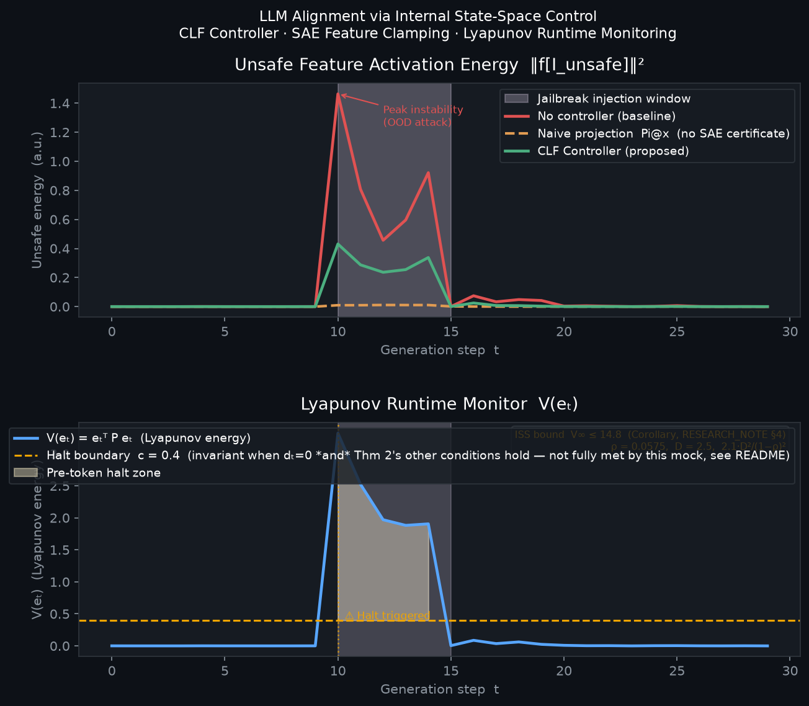

# LLM Alignment via Internal State-Space Control

A simulation framework demonstrating a control-theoretic approach to LLM alignment safety.

This project accompanies the technical note **"Modeling LLM Alignment Failures via Discrete-Time Control Theory"** and provides a runnable toy model of the proposed CLF controller operating on SAE feature coordinates.

---

## Motivation

Existing alignment methods map cleanly onto classical control topologies — and inherit their failure modes:

| Alignment Method | Control Equivalent | Known Failure Mode |
|---|---|---|
| SFT | Feedforward (open-loop) | No error correction on OOD inputs |
| RLHF / DPO | Delayed high-gain feedback | Reward hacking = high-gain instability |
| **This work** | **Internal state-space control** | **Certificate holds only under Thm 2's own conditions (linear plant, zero process noise, `AΠ=ΠA`) — not met even by the mock's own disturbance-free case (§7.1); under active attack `c` is a detection threshold, not a containment guarantee; small-sample/single-seed fragility in feature selection and headline numbers** |

Instead of penalising unsafe *outputs* after generation, the controller acts on the model's internal hidden-state trajectory — suppressing unsafe SAE feature activations before they propagate to the output token.

---

## Architecture

```
llm-control-alignment/
├── src/
│   ├── sae_mock.py     # Sparse Autoencoder mock (feature space projection)
│   ├── system.py       # Nonlinear hidden-state plant + adversarial disturbance
│   ├── controller.py   # CLF controller on unsafe SAE subspace + Lyapunov runtime monitor
│   └── real_sae.py     # Real-model integration: GPT-2 + pre-trained SAE
├── main.py             # Mock simulation runner + plot generation
├── main_real.py        # Real-model demo: GPT-2 small + sae-lens SAE
├── RESEARCH_NOTE.md    # Full theoretical derivation
└── requirements.txt
```

### Core components

**`sae_mock.py`** — defines a fixed 16-feature SAE with 4 "unsafe" concept dimensions (`I_unsafe = [12, 13, 14, 15]`). The dynamic reference state `x_ref,t` is computed by zeroing unsafe feature activations and decoding back to residual space:

```python
f_ref[I_UNSAFE] = 0.0
x_ref = W_dec @ f_ref + b_dec
```

**`system.py`** — simulates discrete-time hidden-state dynamics under a worst-case adversarial disturbance aligned with the unsafe SAE decoder directions (jailbreak injection window).

**`controller.py`** — implements the correction signal `w_t = -α · e_t` projected onto the unsafe feature subspace, with runtime Lyapunov monitoring:

```
V(e_t) = e_t^T P e_t

if V(e_t) >= LYAPUNOV_BOUNDARY:
    → halt generation  (pre-token safety trigger)
```

The boundary `c = 0.4` is a conservative detection threshold set well above the benign-trajectory V level (95th percentile ≈ 0.003 under no disturbance, printed at runtime) and below the ISS bound V∞ ≤ 14.78 — providing ~150× margin above benign noise before triggering a halt. The calibrated benign percentile is printed at runtime for transparency.

The controller is **passive on safe dimensions** (`w_t = 0` when `e_t = 0`) — zero alignment tax by construction.

> **Note on naming:** *H∞-inspired* refers to the structural constraint that `K` acts only on the unsafe subspace — the key property borrowed from H∞ loop-shaping. The gain is proportional rather than synthesised via Riccati; the stability certificate is a Lyapunov CLF, not an H∞ norm bound.

---

## Results



**Top panel — Unsafe Feature Activation Energy:**
- Red (uncontrolled): unsafe activations spike to 1.46 during jailbreak window
- Orange dashed (Naive projection Pi@x): 99.2% post-correction suppression — projects the full Pi@x regardless of ReLU sparsity, leaving only (1-α)·Pi@x ≈ 0.08·Pi@x in the unsafe subspace; the SAE encoder therefore sees near-zero unsafe activations. High suppression reflects aggressive over-correction, not a measurement artefact. No formal ISS certificate.
- Green (CLF Controller): 70.6% suppression (peak: 0.43) — SAE-grounded, with formal ISS certificate and Lyapunov runtime monitor. Naively, clamping with α = 0.92 in feature space would suggest suppression close to (1-α)² ≈ 99.4%; the shortfall to 70.6% is not controller weakness but the empirical signature of SAE overcompleteness (m=16 features > d=8 residual dims, so `W_enc·W_dec ≠ I` on feature space — see the *Remark* after Theorem 1, RESEARCH_NOTE.md §4): the correction is exact in residual space, but re-encoding after correction picks up cross-talk from the other 12 features, so unsafe activations don't scale down by a clean `(1-α)` factor. The 99.2% vs 70.6% split is therefore not just "no certificate vs certificate" — it's "aggressive geometric over-correction, blind to SAE structure" vs "SAE-grounded correction whose limits are exactly the theory's own caveat, made visible".

**Bottom panel — Lyapunov Runtime Monitor:**
- `V(e_t)` exceeds the halt boundary `c` at `t=10` (first attack step); `V` is large under active disturbance but collapses to ≈ 0 within 2 steps after the attack ends
- Shaded region = pre-token halt zone: generation would be stopped *before* an unsafe token is sampled
- The boundary `c` is an invariant-set boundary when `d_t = 0` **and** Theorem 2's other conditions hold (linear plant, `n_t = 0`, `AΠ = ΠA`) — proven for that idealised case, not for the mock itself. Even outside the attack window the mock has a nonlinear term (`W·tanh(x)`), nonzero process noise (`n_t`, std=0.015), and a large commutativity gap (0.68, printed at runtime) — so the disturbance-free invariance is *empirically observed*, not *proven*, for this specific plant, same caveat as the attack-window convergence discussed in RESEARCH_NOTE.md §7.1. Under active attack `c` serves as a detection threshold regardless, not a containment guarantee.

**Robustness — single-seed caveat:** the figures above (`sae_seed=42, plant_seed=0, sim_seed=1`, attack window `t∈[10,15)`) are one realisation, not a robustness claim. `python main.py --sweep 10` reruns the mock across 10 trial seeds × 3 attack windows (30 trials total, seconds of compute — no GPU) and reports medians/ranges instead of one point:

| Quantity | Median | Range |
|---|---|---|
| CLF suppression | 87.1% | [55.7%, 95.2%] |
| Naive suppression | 99.5% | [99.3%, 99.8%] |
| §7.1 ρ(M) | 0.802 | [0.775, 0.808] — < 1 on every trial |

Two things worth noting honestly: the headline single-seed CLF number (70.6%) sits near the **low end** of this range, not at the median — treat 70.6% as a documented instance, not *the* result. And the stability argument (§7.1, `ρ(M) < 1`) held on all 30 trials, so that part is not a single-seed artifact. Use `--seed N` to reproduce a specific single-run plot with a different process-noise seed (SAE/plant seeds are fixed in `run()`; the sweep varies all three).

---

## Installation

```bash
git clone https://github.com/dudesup/llm-control-alignment.git
cd llm-control-alignment
pip install -r requirements.txt
```

## Usage

### Mock simulation (no GPU required)

```bash
# Run with default parameters (30 steps, jailbreak at t=10-15)
python main.py

# Save figure instead of displaying
python main.py --save

# Custom attack window
python main.py --steps 40 --attack-start 12 --attack-end 18 --save

# Different process-noise seed for the single-run plot (sae/plant seeds fixed in run())
python main.py --seed 7 --save

# Robustness sweep: medians/ranges over 10 seeds x 3 attack windows instead of one point
python main.py --sweep 10
```

### Real-model validation: GPT-2 small + pre-trained SAE

> **Status: implemented, not yet validated end-to-end.** The mock simulation above is the
> tested artifact (unit-verified numbers, reproducible via `--seed`/`--sweep`). This script
> is the integration path to a real model — it has not been run to completion, so treat the
> steps below as *designed to do*, not *does*. The highest-risk link is step 3: `sae_lens`
> API signatures have moved across releases, the model/SAE download itself can fail, and
> `identify_unsafe_features` deliberately raises if feature separation on 4 harmful vs. 4
> benign prompts doesn't clear a signal threshold — none of which is knowable before a
> first run.

```bash
# First run downloads GPT-2 (~500 MB) and the SAE checkpoint (~100 MB)
python main_real.py

# Custom prompt and token count
python main_real.py --prompt "How to deceive someone" --tokens 30 --save
```

The real-model demo is designed to:
1. Load GPT-2 small via `transformer_lens`
2. Load the pre-trained layer-8 residual stream SAE via `sae_lens` (Joseph Bloom, 2023)
3. Identify unsafe feature indices by activation difference on harmful vs. benign prompts
4. Run autoregressive generation with and without feature clamping
5. Plot the Lyapunov runtime monitor on real residual-stream activations

---

## Theoretical Background

The full derivation is in [`RESEARCH_NOTE.md`](RESEARCH_NOTE.md). Below is a summary of the formal claims.

### What is proved

**Theorem 1 — Zero Alignment Tax** (exact, no approximation):
The correction $w_t = -\alpha e_t$ satisfies $\langle w_t, v_s \rangle = 0$ for every safe feature direction $v_s \perp \mathrm{range}(\Pi)$. Proof: $W_{\mathrm{dec}}[:,\mathcal{I}]^\top v_s = 0$ for $v_s \perp \mathrm{range}(\Pi)$.

**Theorem 2 — CLF Exponential Decay** (noise-free, linearised plant):
$V(e_{t+1}) \leq (1{-}\alpha)^2 \rho_u^2\; V(e_t)$, convergence rate $\approx 0.06$ per step.

**Proposition 1 — Input-to-State Stability** (bounded disturbance):
$V(e_{t+1}) \leq 2\rho^2 V(e_t) + 4.2 D^2$. Steady state: $V_\infty \leq 4.2 D^2 / (1{-}2\rho^2) \approx 26.4$; Corollary gives tight $V_\infty \leq 2.1D^2/(1{-}\rho)^2 \approx 14.78$.
This explains why V is bounded (not diverging) during the attack window, and why V → 0 geometrically after the attack ends.

### What is not proved

The ISS certificate holds under the linearised plant and the commutativity assumption $A\Pi = \Pi A$. For the full nonlinear transformer plant, these conditions are not verified — the `real_sae.py` integration is designed to show that the **mechanism** (encode → clamp → decode) is technically feasible, not that the certificate transfers, and (like the rest of the real-model path) has not itself been run end-to-end yet. See RESEARCH_NOTE.md §6–7.

### Note on the "H∞-inspired" label

The controller is a proportional CLF state feedback, not an H∞-optimal controller (no Riccati equation, no $\mathcal{H}_\infty$ norm bound is proven). The structural parallel to H∞ loop-shaping is limited to one property: zero gain on safe-subspace directions. See RESEARCH_NOTE.md §5.

### Key equations

Dynamic reference state:
$$x_{\mathrm{ref},t} = W_{\mathrm{dec}}\, f^{\mathrm{safe}}_t, \quad f^{\mathrm{safe}}_t[i] = 0 \text{ for } i \in \mathcal{I}$$

Control law ($e_t \in \mathrm{range}(\Pi)$ exactly, by direct feature construction — see RESEARCH_NOTE §2):
$$w_t = -\alpha\, e_t, \qquad e_t = W_{\mathrm{dec}}[:, \mathcal{I}]\; f_t[\mathcal{I}] \in \mathrm{range}(\Pi)$$

ISS dissipation inequality (Proposition 1 + Corollary):
$$V(e_{t+1}) \leq 2\rho^2\, V(e_t) + 4.2\,D^2, \qquad \rho = (1{-}\alpha)\rho_u, \quad V_\infty \leq \frac{2.1\,D^2}{(1-\rho)^2}$$

---

## Relation to Existing Work

This framework generalises **activation steering / representation engineering** (Turner et al. 2024, Zou et al. 2025) in three ways:

- Reference state grounded in SAE feature coordinates rather than raw difference-in-means
- Correction derived from a formal CLF rather than heuristic scalar scaling
- Runtime monitor with known ISS properties rather than empirical evaluation only

It complements **MPC-based alignment** — Wang, Chen, Hung, Ko, Ding, Wu, Wang, Yang, Peng & Hsieh, ["Test-Time Alignment for Large Language Models via Textual Model Predictive Control"](https://arxiv.org/abs/2502.20795) (arXiv:2502.20795) — which operates at the output trajectory level — this controller acts at the internal state level.

---

## Disclaimer

This is a **toy model**. The plant is a low-dimensional mock, not a real transformer. The SAE is synthetic. No claims are made about production-scale LLMs.

The value of this simulation is not empirical — it is to make the theoretical framework *executable and falsifiable*, and to demonstrate that the Lyapunov monitoring mechanism is computationally tractable.

---

## Citation

If you build on this work:

```bibtex
@misc{supinska2026llmcontrol,
  title  = {Modeling LLM Alignment Failures via Discrete-Time Control Theory},
  author = {Daria Supinska},
  year   = {2026},
  url    = {https://github.com/dudesup/llm-control-alignment}
}
```
